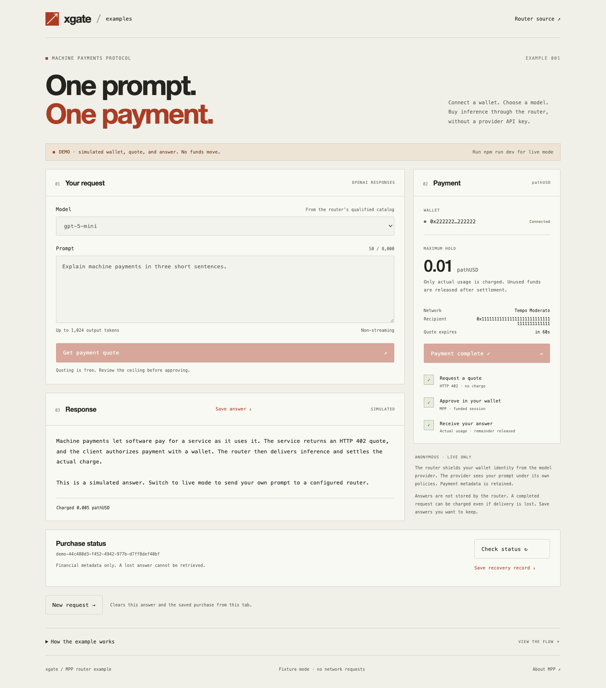

# xgate · MPP router example

A small React + TypeScript app that connects a browser wallet, requests an inference quote from [402-router](https://github.com/daydreamsai/402-router), approves a Tempo MPP session, and displays the answer and payment receipt. No provider API key is needed in the browser.

The app picks the route from the router’s qualified catalog: OpenAI `/providers/openai/v1/responses` or Anthropic `/providers/anthropic/v1/messages`, both under the `anonymous-volatile-v1` contract. It offers two payment methods:

- **x402 · Base USDC (default).** The router’s `exact` offer on Base (Sepolia on testnet). The wallet signs one EIP-3009 USDC transfer authorization with `eth_signTypedData_v4`, which standard wallets such as MetaMask support. The quoted price is charged in full only when inference succeeds.
- **MPP · Tempo.** One funded session per purchase: the displayed ceiling is a **hold**, successful inference is charged for actual usage, and the remainder is released. This needs a wallet that can sign Tempo transactions without broadcasting them (see below); MetaMask cannot.

Failed inference is zero charge. A result lost **after** the router commits completion can still be charged.



## Try it without a router or wallet

Requires Node.js 24 and npm. From this repository:

```sh
npm ci
npm run demo
```

Open [localhost:5173](http://127.0.0.1:5173). Connect the demo wallet, get a quote, and approve the simulated request. **Demo mode uses labelled fixtures and makes no wallet, RPC, router, or provider requests.** It is useful for exploring the UI, not payment conformance. The fixture module is excluded from the normal production build.

## Connect a real router

```sh
cp .env.example .env.local
# Edit .env.local using the values from your router operator.
npm run dev
```

| Setting            | Purpose                                                                                                                                                           |
| ------------------ | ----------------------------------------------------------------------------------------------------------------------------------------------------------------- |
| `ROUTER_ORIGIN`    | Exact API origin, with no path or trailing slash. Default: `http://127.0.0.1:38080`. HTTPS is required except for loopback.                                       |
| `ROUTER_RECIPIENT` | Expected payment recipient (used for both Base and Tempo offers), obtained independently from your router operator. Required before a live quote can be accepted. |
| `TEMPO_NETWORK`    | `testnet` (default) or `mainnet`. Changes the chain and token together.                                                                                           |
| `MAX_PAYMENT`      | Maximum per-request deposit, in token units. Default `0.10`; at most six decimal places. This is a client limit, not a price.                                     |

Restart Vite after changing configuration. These values are public; **never put a wallet key, provider key, private RPC credential, or operator secret in this app.**

The router must already have:

- The `tempo-mpp` payment profile enabled with the matching network and payee.
- A fresh model catalog and a qualified Anonymous Responses deployment. The app only offers models returned by `/v1/models` with `responses` in `qualified_operations`.
- Its own provider credentials, fee sponsorship, payment journal, and serving qualification. Starting this app does not configure or qualify the router.
- For wallet-allowlisted staging, the connected buyer wallet admitted by the operator.

The default request uses up to 1,024 output tokens, no streaming, and `store: false`. `gpt-5-mini` selects minimal reasoning; other discovered models use their default. A model’s quote remains authoritative and may exceed the local spending limit.

### Wallet compatibility

The x402 method works with any injected EVM wallet that supports `eth_signTypedData_v4` and can switch to Base. The rest of this section applies to the MPP method.

Use an injected EIP-1193 / EIP-6963 browser wallet with a **direct secp256k1 account** that supports all of:

1. `eth_requestAccounts`, `eth_accounts`, and `eth_chainId`.
2. Switching to Tempo, optionally adding the chain.
3. `eth_signTransaction` for a sponsored Tempo `0x78` transaction, including calls and expiring nonces, **without broadcasting it**.
4. `eth_signTypedData_v4` for the session voucher.

Merely connecting an EVM wallet does **not** establish these signing capabilities. Many general-purpose extensions disable `eth_signTransaction` or do not support Tempo envelopes. This repo does not claim compatibility with a named extension without a signed test. The wallet must retain the fee-payer placeholder and leave the fee token unset so the router can sponsor submission.

The current router rejects passkey/P-256/WebAuthn signatures, access keys, delegated accounts, authorization lists, and access lists in this payment profile. This example checks the returned envelope before submitting it and deliberately does not change the router or request a private key. Unsupported wallets receive a signing error before any paid HTTP request. A browser-wallet integration test with synthetic RPC/wallet responses is not a real extension or funded test.

### Network and asset pins

| Environment    | Chain ID | Accepted asset  | Token address                                |
| -------------- | -------- | --------------- | -------------------------------------------- |
| Tempo Moderato | 42431    | Faucet pathUSD  | `0x20c0000000000000000000000000000000000000` |
| Tempo mainnet  | 4217     | Stargate USDC.e | `0x20c000000000000000000000b9537d11c60e8b50` |

Both use TIP-1034 escrow `0x4d50500000000000000000000000000000000000`. Mainnet must be selected explicitly and requires an appropriately configured router and funded compatible wallet. The app does not auto-swap tokens, top up channels, or broadcast transactions. The router sponsors the opening and finalizes the session. Live funded tests require a separately authorized environment and spend allowance.

## The payment flow

```text
Browser                     Local Vite proxy                 Router
  POST original body --------------------------------------> 402 quote
  validate chain / token / recipient / ceiling / privacy <--- MPP challenge
  save private recovery metadata in this tab
  ask browser wallet to sign (mppx, no broadcast)
  POST same bytes + Authorization + X-Quote-Binding --------> fund → infer → settle
                  + X-Status-Token <----------------------- live answer + Payment-Receipt
  GET purchase status / receipt ---------------------------> financial metadata only
```

[`src/router.ts`](src/router.ts) owns quote validation, exact request-byte reuse, one paid submission, receipt matching, bounded response reading, and GET-only recovery. [`src/discovery.ts`](src/discovery.ts) finds and connects EIP-6963 wallets. [`src/wallet.ts`](src/wallet.ts), loaded only when a payment is approved, contains the actual `mppx@0.9.2` / `viem@2.55.13` signing integration, pinned to the router’s reviewed client versions. [`src/App.tsx`](src/App.tsx) owns state and the browser checkpoint; [`src/Playground.tsx`](src/Playground.tsx) is presentation-only.

`Mppx.create({ polyfill: false })` and `preparePayment()` are intentional. An automatic payment fetch wrapper could hide a second authorization or paid retry after an uncertain outcome. The example explicitly makes one unpaid request and at most one paid request. No paid POST is retried, redirected, or replayed by recovery.

The app checks native MPP receipt fields against the challenge, channel, and ceiling. It relies on the configured router’s verified receipt; it does not independently audit on-chain balances, settlement finality, pricing arithmetic, or provider usage.

## Recovery and privacy

The original live HTTP response is the only answer delivery. **Check status** uses the saved purchase ID and private status token; it never generates a replacement answer. Unknown payment is not presented as a zero charge. New purchases remain blocked in the current tab while a submitted purchase is unresolved.

The app saves only the router origin, network, purchase ID, status token, accepted ceiling, and submission marker in `sessionStorage`, before the paid request. It saves no prompt, answer, payment credential, or wallet secret there. The checkpoint survives a refresh in the same tab. **Save recovery record** downloads that metadata for manual recovery after closing the tab; keep the file private because the token grants access to purchase metadata.

To inspect an exported record without submitting inference:

```sh
node scripts/recover.mjs private-purchase-recovery.json https://YOUR_ROUTER_ORIGIN
```

The second argument must exactly match the original origin. The script performs two bounded GETs and prints only status/receipt bodies. It never loads a wallet or sends a payment. Demo records cannot be used against a real router.

**Save answer** downloads the original JSON locally. **New request** clears the answer and checkpoint from this tab after a terminal outcome, or discards an unpaid quote. Closing a tab does not reverse an already committed charge. A recovery record from another router configuration requires restoring that configuration.

Anonymous means the router shields payment identity from the upstream model provider. The router and its ingress can see the prompt; the provider receives it under its own policies. Payment metadata remains retained. This example has no analytics, remote fonts, service worker, or automatic answer storage. Browser wallet extensions and explicitly downloaded files have their own storage behavior.

### Why a proxy?

The current router code does not provide the browser CORS layer needed for these headers. Vite forwards only the example’s model, Responses, status, and receipt routes to the **fixed configured origin**, strips browser identity/cookie headers, preserves exact body bytes, and adds `Cache-Control: no-store`. It does not follow redirects or calculate prices. Both development and preview use this local proxy. The proxy necessarily sees plaintext content and payment headers in memory.

`npm run build` creates static assets; `npm run preview` serves them locally with the proxy. **Vite preview is not a production server.** Static hosting alone will not provide `/router`. A deployed demo must use a reviewed same-origin proxy with equivalent allowlists, bounded bodies/timeouts, cancellation, no retries, no content logging or caching, and the router’s required privacy qualification—or call a router with explicitly configured CORS. Public production deployment is outside this basic example.

## Development and checks

```sh
npm run check              # formatting, TypeScript, deterministic tests, production build
npm run storybook          # component states at http://127.0.0.1:6006
npm run build:storybook
npx playwright install chromium
npm run test:browser       # desktop/mobile demo, expiry and refresh recovery
npm run build
npm run preview            # http://127.0.0.1:4173 (live mode, configuration required)
```

Storybook includes the initial, unavailable, running, lost-delivery, and successful-response states. The GitHub Actions workflow installs from the lockfile and runs the same checks. Unit tests exercise mismatched offers, duplicate submissions, transport loss, bounded reads, checkpoint failures, receipt mismatches, and pending financial outcomes. Browser tests use labelled fixtures and do not move funds.

Implementation references: [router Anonymous contract](https://github.com/daydreamsai/402-router/blob/main/docs/anonymous-inference.md), [Tempo adapter](https://github.com/daydreamsai/402-router/tree/main/packages/rust/payment-tempo), and [MPP session client source](https://github.com/wevm/mppx/tree/main/src/tempo/session). Inspect the pinned installed sources when updating dependencies; current upstream APIs may differ.
